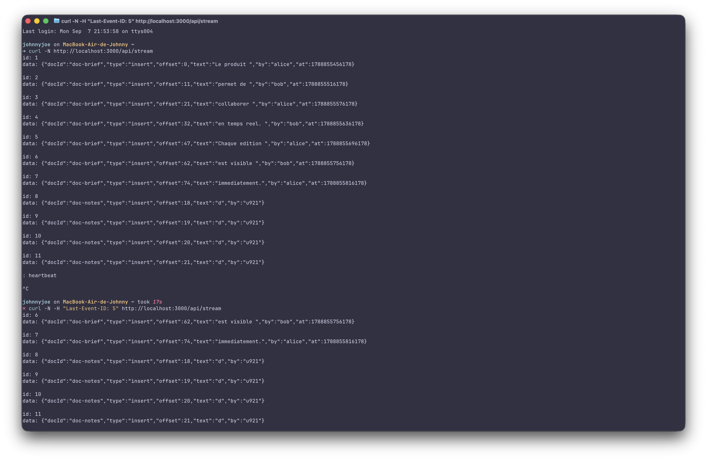

# ADR-1 : technique de push

## Statut
Proposé

## Contexte
L'editeur collaboratif possede un flux principal bidirectionnel : les clients envoient leurs
operations d'edition au serveur, qui les diffuse ensuite aux autres utilisateurs. Un flux
secondaire permet egalement de consulter l'historique des operations en lecture seule.

## Options envisagees
- Long-polling
- Server-Sent Events (SSE)
- WebSocket
- WebRTC

## Decision
WebSocket est envisage pour le flux principal, car l'edition necessite une communication
bidirectionnelle. SSE est utilise pour diffuser l'historique des operations du serveur vers les
clients avec un mecanisme de rattrapage base sur `Last-Event-ID`.

## Pourquoi pas WebRTC pour le flux principal
Le serveur doit controler, ordonner et conserver les operations, ce qui rend une communication
principalement pair-a-pair inadaptee.

## Consequences
SSE offre un flux simple et rattrapable en lecture seule, mais ne permet pas aux clients d'envoyer
leurs modifications. WebSocket reste donc necessaire pour le flux d'edition bidirectionnel.

## Preuve du rattrapage SSE

