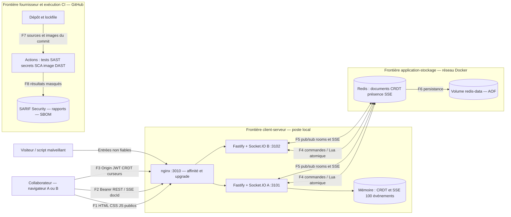

# Threat model STRIDE — Pagespace

6 octobre 2026. Référence avant : `cdc7fec`. DFD du service réellement exécuté après corrections.

## 1. DFD

## 2. Trust boundaries

| Frontière | Enjeu | Contrôle réel / limite |
|---|---|---|
| TB1 client → nginx/Fastify | Identité, docId, room, JSON, JWT, Origin non fiables | JWT HS256 issuer/audience/expiration ; ACL lors du chargement REST/SSE et du join/op ; corps HTTP/WS 64 Kio ; origines explicites |
| TB1 canal Socket.IO persistant | Le handshake n'autorise pas tous les futurs objets | ACL par document et auteur serveur ; fermeture à expiration ; lots validés avant mutation ; 20 lots d'édition/s et 60 événements éphémères/s par socket |
| TB2 app → Redis/volume | Redis est l'autorité partagée | Non publié sur l'hôte, Lua/transactions atomiques, bail de présence ; ACL Redis/TLS et purge documentaire restent à faire |
| TB3 dépôt → runner → registres | Sources, dépendances et images de tiers | Lockfile, scanners versionnés, actions épinglées par SHA, bases par digest ; permissions minimales, seuils explicites, rapport invalide bloquant |
| Local → production | Les profils demo ne prouvent aucune identité | Mode demo interdit en production, clé obligatoire, métriques masquées ; IdP et HTTPS nécessaires |

Les ports directs A/B restent des entrées TB1 : nginx ne remplace pas la sécurité applicative. HTTP est réservé au poste local ; HSTS est activé en production derrière HTTPS.

## 3. STRIDE priorisé

H = avant ouverture/livraison ; M = planifié avant usage réel ; L = amélioration. Impact métier, exposition et exploitabilité guident la priorité (SEC-2).

| ID / flux | STRIDE | Menace spécifique | Exigence mesurable | Priorité | BE → ER | Trace |
|---|---|---|---|---|---|---|
| S-01 / F2 | I | Bob/visiteur lit texte, historique, snapshot ou SSE du brief réservé à Alice | 401 sans JWT, 403 hors ACL, liste filtrée, SSE par docId autorisé | H | BE1/BE4 → ER1 | F-01 ; tests REST/SSE et règle SAST de chargement |
| S-02 / F3 | S/E | Clé connue : JWT Alice forgé, room privée rejointe | Secret aléatoire hors dépôt et commun A/B, HS256/issuer/audience/exp ; fermeture à expiration ; aucun login demo en production | H | BE2/BE1 → ER2/ER1 | F-02 ; Gitleaks/Semgrep ; tests JWT/production |
| S-03 / F3/F4 | T/D | Paquets énormes/malformés et concurrence provoquent corruption ou divergence | Validation atomique, 512 ops/lot, 64 Kio/paquet, débit borné ; positions stables, tombstones et déduplication | H | BE2/BE3 → ER2/ER3 | Tests sécurité/TP6/TP7 ; accumulation F-05 restante |
| S-04 / F3 | S/I | Page tierce tente un handshake WS malgré le CORS | Origin dans allowRequest + JWT + ACL par room | M | BE1 → ER1 | Test handshake Origin ; SEC-1 |
| S-05 / F1 | T/I | Contexte navigateur permissif aggrave une injection frontend | script-src self, scripts locaux externes, nosniff, anti-frame, Referrer-Policy, COOP/COEP, API no-store | M | BE1/BE2 → ER1/ER2 | F-03 ; ZAP, tests d'en-têtes et navigateur |
| S-06 / F7 | T/E | Bibliothèque/base affectée ouvre une route de contournement ou DoS | npm + OSV, Trivy, zéro HIGH/CRITICAL, SBOM, politique de MAJ | M | BE1/BE3 → ER1/ER3 | F-04 ; jobs deps-scan/sbom/image-scan |
| S-07 / F6 | I/D | Historique/CRDT/AOF croissent sans durée ni quota | Purge, quotas et compactage sûr ; conserver les tombstones nécessaires aux reprises | M | BE4/BE3 → ER4/ER3 | F-05 ; action R-03 non faite |
| S-08 / F3/F4 | R | Contribution contestée | Auteur du JWT et horodatage ; journal d'audit protégé à ajouter | M | BE2 → ER2 | Test auteur TP6 ; R-04 |
| S-09 / F3/F5 | D | Coupure réseau/bascule A → B | Reconnexion/snapshot/tombstones, grâce 5 s, état/fan-out Redis | M | BE3 → ER3 | 15 contrôles TP7 ; ADR temps réel 3 |
| S-10 / F8 | I | Rapport CI divulgue une clé | Gitleaks redact, SARIF sans valeur, .env hors Git/image | L | BE4 → ER1 | Convertisseur SARIF et ignores |

## 4. Correspondance EBIOS des H et suivi

- S-01 — **BE1/BE4 → ER1** : le canal secondaire expose le brief. Contrôle commun au chargement, puis tests de tous les lecteurs et du filtre SSE. Masquer le sélecteur ne suffit pas.
- S-02 — **BE2/BE1 → ER2/ER1** : vérifier une signature avec une clé connue n'authentifie personne. Rotation, rejet de l'ancienne clé, exclusion de la seule empreinte historique invalidée ; secrets et SAST en CI.
- S-03 — **BE2/BE3 → ER2/ER3** : un utilisateur autorisé reste une source d'entrées malveillantes. Limites/validation pour l'entrée ; CRDT pour ordre/doublons ; accumulation dans le temps suivie séparément en F-05.

## 5. Limites

ZAP baseline est un crawl passif, pas une preuve d'ACL ni une analyse approfondie des messages WebSocket. Les tests complètent les scanners. Aucun SQL, paiement, mot de passe stocké ou WebRTC n'existe ici : leurs failles Juice Shop ne sont pas inventées. Un pipeline vert n'efface pas les risques résiduels.
